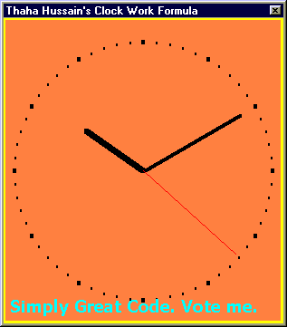

<div align="center">

## a  \-An Analog Clock which is VERY SIMPLE\!\!


</div>

### Description

Thaha Hussain's Clock-Work Formula:

In most of the computer languages, X-axis is taken correctly. But Y-axis in the reverse of the normal Cartisian axis (Y-axis is incremented downword not upword) . So usual analytic manipulations such as, shifting the origin, calculation of polar co-ordinates etc become difficult. Ofcourse, VB has techniques to correct this problem by scaling. But for many lanuages, it is not available! The formula described can be used in any programming language which has inverted Y-axis (C, BASIC etc.).

These are the difficulties faced while deriving the formulae.

1) The Y axis Problem.

2) Polar angles are measured in anti-clockwise direction, while the clock hands are moved in clockwise direction.

3) 'Zero' of polar angle and 'Zero' of Clock Hands causes a difference of 90 degrees.

The following are the Formulae obtained.

Feel free to use the formula for non-commercial purposes. However the Author's name should be accompanied along with the formula.

Thaha Hussain's clock work formula

Hour Hand :

hour_x2 = LengthOfHourHand * Cos(PI/180*(30 * hour - 90)) + midx

hour_y2 = LengthOfHourHand * Sin(PI/180*(30 * hour - 90)) + midy

Minute Hand:

minute_x2 = LengthOfMinuteHand * Cos(PI/180*(6 * minute - 90)) + midx

minute_y2 = LengthOfMinuteHand * Sin(PI/180*(6 * minute - 90)) + midy

Soconds Hand:

second_x2 = LengthOfSecondsHand * Cos(PI/180*(6 * second - 90)) + midx

second_y2 = LengthOfSecondsHand * Sin(PI/180*(6 * second - 90)) + midy

You'll never get a formula simpler than this to move the clock hands!

1) You can use the formulae in any Programming Language without the Co-ordinate adjustment!

2) No problem for hour, even in 24 Hr format!

3) You can adjust the Length of Clock Hands!

4) Shift the clock to anywhere by changing (midx,midy)

5) Create your own custom controls!

6) A variety of other uses in graphics!

Simply Excellent! Right? Please vote for the formulae!
 
### More Info
 
In a form place 3 lines (Line1, Line2, Line3) and a timer (Timer1)

and a shape (Shape1). Paste the code.


<span>             |<span>
---                |---
**Submitted On**   |
**By**             |[K\. O\. Thaha Hussain](https://github.com/Planet-Source-Code/PSCIndex/blob/master/ByAuthor/k-o-thaha-hussain.md)
**Level**          |Beginner
**User Rating**    |4.3 (129 globes from 30 users)
**Compatibility**  |VB 4\.0 \(32\-bit\), VB 5\.0, VB 6\.0
**Category**       |[Math/ Dates](https://github.com/Planet-Source-Code/PSCIndex/blob/master/ByCategory/math-dates__1-37.md)
**World**          |[Visual Basic](https://github.com/Planet-Source-Code/PSCIndex/blob/master/ByWorld/visual-basic.md)
**Archive File**   |[](https://github.com/Planet-Source-Code/k-o-thaha-hussain-a-an-analog-clock-which-is-very-simple__1-22038/archive/master.zip)


### Source Code

```
' In the name of The Almighty...
' (C) K. O. Thaha Hussain, Systems Analyst
' www.microcentergulf.com Manama, Bahrain
' *** LICENSE AGREEMENT ***
' Get permission from the author to use
' the formulae commercially.
' Feel free to make use of the Formulae
' for Non-Commercial Purposes,
' but the name of the Author should be a
' ccompanied along with the formulae.
Option Explicit
Dim HourLength As Integer, MinuteLength As Integer, _
              SecondLength As Integer
Dim MidX As Integer, MidY As Integer
Const PI = 3.14159
Sub LengthAndCentre()
  Dim d As Integer
  If Me.ScaleWidth < Me.ScaleHeight Then
    HourLength = Me.ScaleWidth * 50 / 200 ' 50%
    MinuteLength = Me.ScaleWidth * 80 / 200 ' 80%
    SecondLength = Me.ScaleWidth * 90 / 200 ' 90%
  Else
    HourLength = Me.ScaleHeight * 50 / 200 ' 50%
    MinuteLength = Me.ScaleHeight * 80 / 200 ' 80%
    SecondLength = Me.ScaleHeight * 90 / 200 ' 90%
  End If
  MidX = Me.ScaleWidth \ 2
  MidY = Me.ScaleHeight \ 2
  Line1.X1 = MidX
  Line2.X1 = MidX
  Line3.X1 = MidX
  '
  Line1.Y1 = MidY
  Line2.Y1 = MidY
  Line3.Y1 = MidY
  d = Shape1.BorderWidth \ 2
  Shape1.Left = d
  Shape1.Top = d
  Shape1.Width = Me.ScaleWidth - d * 2
  Shape1.Height = Me.ScaleHeight - d * 2
  Call Timer1_Timer 'just To avoid flicker
End Sub
Private Sub DrawDial()
 ' Procedure to draw the dial
 ' using Clock Work Formula.
 Dim I, HourX, HourY, MinuteX, MinuteY, DialLength As Integer
 Me.Cls
 If Me.ScaleWidth < Me.ScaleHeight Then
  DialLength = Me.ScaleWidth * 92 / 200 ' 92%
 Else
  DialLength = Me.ScaleHeight * 92 / 200 ' 92%
 End If
 'The following loop is doing hour marking
 For I = 1 To 12
  Me.DrawWidth = 4
  HourX = DialLength * Cos(PI / 180 * (30 * I - 90)) + MidX
  HourY = DialLength * Sin(PI / 180 * (30 * I - 90)) + MidY
  PSet (HourX, HourY)
 Next I
'The following loop is doing minute marking
 For I = 1 To 59
  Me.DrawWidth = 2
  MinuteX = DialLength * Cos(PI / 180 * (6 * I - 90)) + MidX
  MinuteY = DialLength * Sin(PI / 180 * (6 * I - 90)) + MidY
  PSet (MinuteX, MinuteY)
 Next I
End Sub
Private Sub Form_Load()
  Me.Caption = "Thaha Hussain's Clock Work Formula"
  Me.AutoRedraw = True
  Me.BackColor = &H80FF&
  '
  Shape1.BorderWidth = 4
  Shape1.BorderColor = vbYellow
  Line1.BorderWidth = 5
  Line2.BorderWidth = 3
  Line3.BorderWidth = 1
  Line3.BorderColor = vbRed
  '
  Timer1.Interval = 1000
  '
  Call LengthAndCentre
  Call Timer1_Timer 'just To avoid initial flicker
  '
  MsgBox "Resize the window to resize the clock...", , _
  "Thaha Hussain's Clock-Work Formula"
End Sub
Private Sub Form_Resize()
  On Error Resume Next
  Call LengthAndCentre
  Call DrawDial
End Sub
Private Sub Timer1_Timer()
  Dim Hours As Single, Minutes As Single, Seconds As Single
  Dim TrueHours As Single
  'Beep
  Hours = Hour(Time)
  Minutes = Minute(Time)
  Seconds = Second(Time)
  TrueHours = Hours + Minutes / 60
  'HourHand
  Line1.X2 = HourLength * Cos(PI / 180 * (30 * TrueHours - 90)) + MidX
  Line1.Y2 = HourLength * Sin(PI / 180 * (30 * TrueHours - 90)) + MidY
  'MinuteHand
  Line2.X2 = MinuteLength * Cos(PI / 180 * (6 * Minutes - 90)) + MidX
  Line2.Y2 = MinuteLength * Sin(PI / 180 * (6 * Minutes - 90)) + MidY
  'SecondsHand
  Line3.X2 = SecondLength * Cos(PI / 180 * (6 * Seconds - 90)) + MidX
  Line3.Y2 = SecondLength * Sin(PI / 180 * (6 * Seconds - 90)) + MidY
End Sub
```

